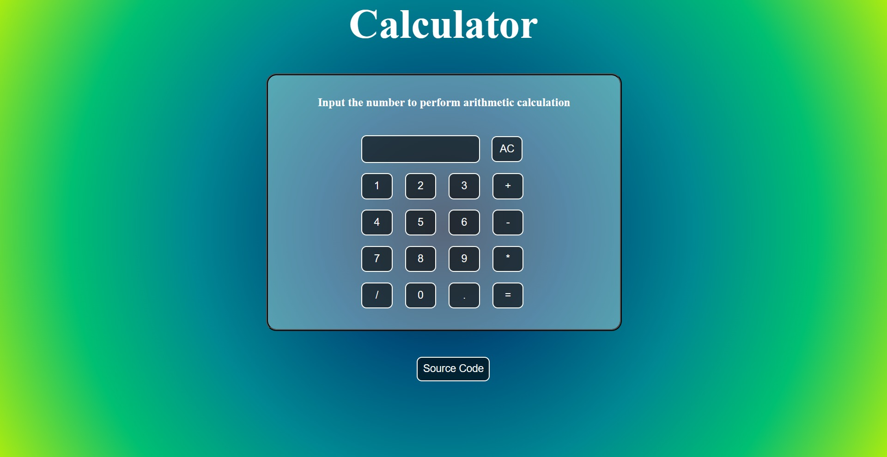

# Basic Arithmetic Calculator 
### In these calculator we evaluate only arithmetic operation like addition,subtraction,muplication and division by taking input throung given button not from user keyboard input
  

  
To view the calcultor [**click here**](https://basic-calculator-101.netlify.app/)

